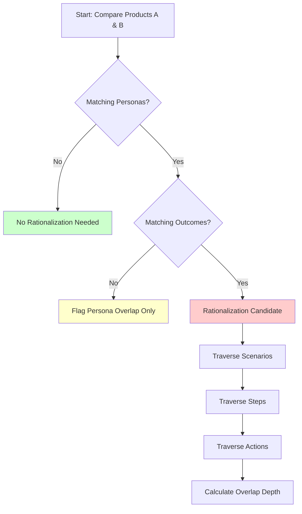
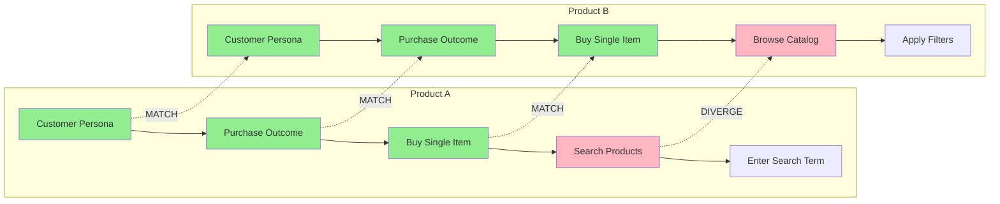
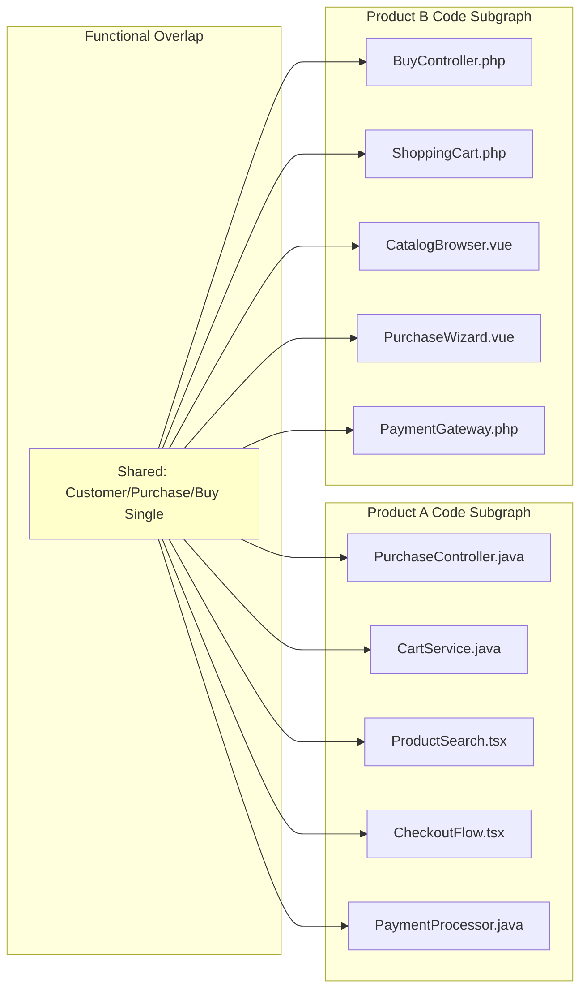
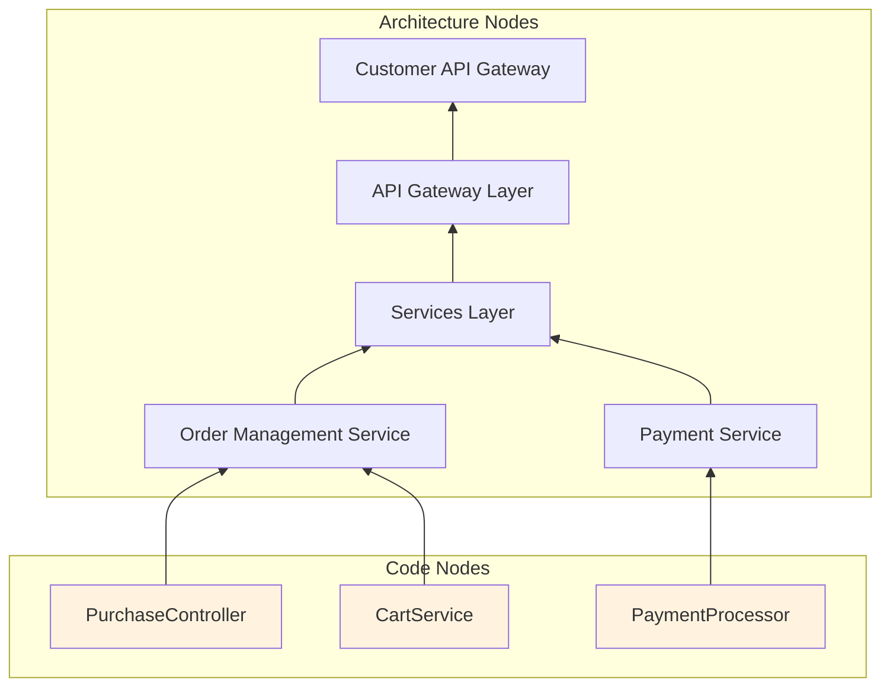
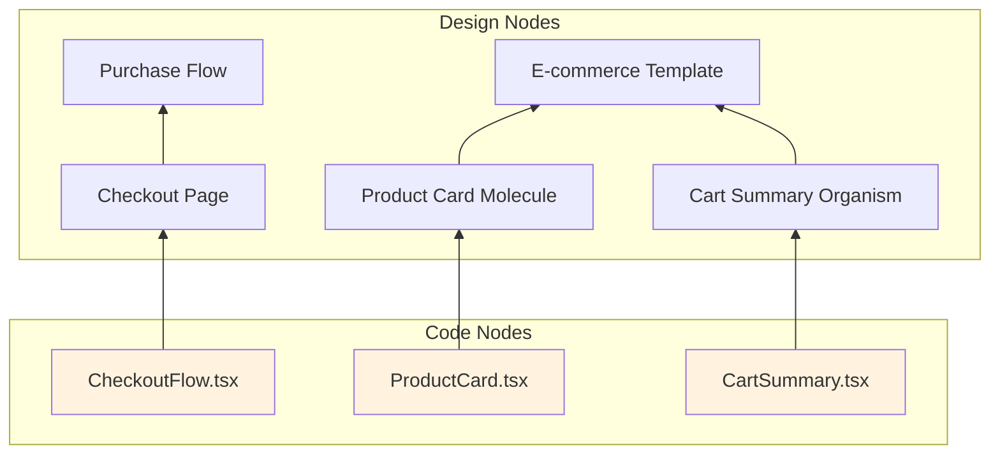
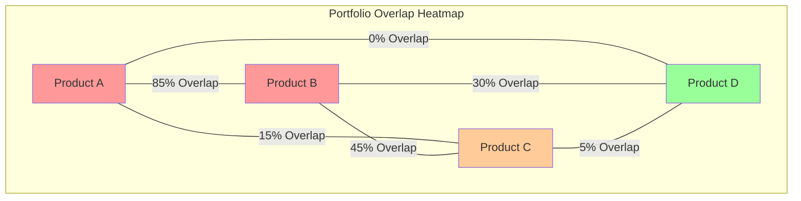

# Breeze.AI Portfolio Rationalization Framework

## Executive Summary

Portfolio rationalization using Breeze.AI knowledge graphs provides a systematic, quantifiable approach to identifying functional overlaps across products and evaluating various consolidation strategies. By leveraging the four interconnected ontologies (Functional, Design, Architecture, and Code), organizations can make data-driven decisions about portfolio optimization without relying on subjective assessments.

## Core Principles

1. **Functional Overlap as Foundation**: Rationalization opportunities exist only when products share both personas and outcomes
2. **Code Impact as Risk Metric**: The number of affected code nodes directly correlates with implementation risk and effort
3. **Strategy Comparison, Not Prescription**: The framework quantifies options rather than recommending specific approaches
4. **Multi-Dimensional Analysis**: Evaluate UI, architecture, and full-stack rationalization strategies independently

## Phase 1: Functional Overlap Discovery

### Overlap Detection Algorithm



### Functional Overlap Metrics

|Overlap Level|Definition|Rationalization Potential|
|---|---|---|
|**Level 1: Persona + Outcome**|Same user type, same high-level goal|High - Major consolidation opportunity|
|**Level 2: + Scenarios**|Same use cases within outcome|Medium-High - Significant shared functionality|
|**Level 3: + Steps**|Same workflow progression|Medium - Detailed process alignment|
|**Level 4: + Actions**|Identical atomic interactions|Low - Already highly aligned|

### Overlap Visualization



**Overlap Analysis**: Products A & B share functionality down to Level 3 (Scenarios), diverging at Steps.

## Phase 2: Code Impact Analysis

### Target Code Subgraph Identification

Once functional overlaps are identified, trace connections to code graphs:



### Code Impact Metrics

|Metric|Formula|Purpose|
|---|---|---|
|**Direct Impact Count**|Count of code nodes in overlapping subgraphs|Measure immediate changes required|
|**Dependency Impact**|Count of code nodes depending on subgraph|Assess ripple effects|
|**Cross-Product Variance**|Structural differences in code subgraphs|Estimate integration complexity|
|**Technology Stack Divergence**|Different languages/frameworks used|Identify migration requirements|

## Phase 3: Architecture & Design Impact Traversal

### Architecture Subgraph Discovery

From identified code subgraphs, traverse up to architecture nodes:



### Design Subgraph Discovery

Similarly, traverse from code to design nodes:



## Phase 4: Rationalization Strategy Evaluation

### Strategy Types and Scope

|Strategy Type|Scope|Impact Analysis|
|---|---|---|
|**UI-Only Rationalization**|Design + Frontend Code|Changes to design graphs and UI code nodes only|
|**Service Consolidation**|Architecture + Backend Code|Merges service boundaries and backend implementations|
|**Full-Stack Rationalization**|All Ontologies|Complete functional area consolidation|
|**Data Model Alignment**|Architecture + Data Code|Standardizes data structures and persistence|
|**API Harmonization**|Architecture + Integration Code|Aligns external interfaces only|

### Quantitative Strategy Comparison Framework

For each potential rationalization strategy, calculate:

#### 1. Implementation Impact Score

```
Impact Score = (
    Direct Code Nodes Affected × 1.0 +
    Dependent Code Nodes × 0.5 +
    Architecture Nodes Changed × 2.0 +
    Design Nodes Modified × 1.5
) / Total Nodes in Subgraph
```

#### 2. Risk Assessment Matrix

|Risk Factor|Weight|Measurement|
|---|---|---|
|**Code Volume**|30%|Lines of code in affected nodes|
|**Technology Divergence**|25%|Number of different tech stacks|
|**Integration Points**|20%|External dependencies count|
|**User Impact**|15%|Active users on affected features|
|**Data Migration**|10%|Data structure differences|

#### 3. Effort Estimation Model

```
Effort Points = 
    Code Nodes × Complexity Factor +
    Architecture Changes × 3 +
    Design Changes × 2 +
    Integration Points × 2 +
    Data Migration Complexity
```

Where Complexity Factor varies by:

- Simple refactoring: 1 point
- Logic consolidation: 3 points
- Technology migration: 5 points

### Strategy Comparison Dashboard

```
Rationalization Strategy Comparison for Products A & B
Functional Overlap: Customer → Purchase → Buy Single Item

Strategy 1: UI-Only Rationalization
├── Impact Score: 3.2
├── Risk Level: Low (25%)
├── Effort Estimate: 45 points
├── Affected Nodes:
│   ├── Design: 12 nodes
│   ├── Frontend Code: 34 nodes
│   └── Backend Code: 0 nodes
└── ROI Potential: Medium

Strategy 2: Service Consolidation
├── Impact Score: 6.8
├── Risk Level: High (72%)
├── Effort Estimate: 120 points
├── Affected Nodes:
│   ├── Architecture: 8 nodes
│   ├── Backend Code: 67 nodes
│   └── Data Code: 23 nodes
└── ROI Potential: High

Strategy 3: Full-Stack Rationalization
├── Impact Score: 8.4
├── Risk Level: Very High (85%)
├── Effort Estimate: 180 points
├── Affected Nodes:
│   ├── All Ontologies: 156 nodes
│   └── Dependencies: 89 nodes
└── ROI Potential: Very High
```

## Phase 5: Multi-Product Portfolio Analysis

### Portfolio Overlap Matrix

For portfolios with multiple products, create a comprehensive overlap matrix:



### Overlap Calculation Formula

```
Overlap % = (
    Shared Functional Nodes at Outcome Level × 100 +
    Shared Functional Nodes at Scenario Level × 50 +
    Shared Functional Nodes at Step Level × 25 +
    Shared Functional Nodes at Action Level × 10
) / Total Functional Nodes in Smaller Product
```

### Portfolio Rationalization Scenarios

#### Scenario 1: Pairwise Consolidation

- Merge highest overlap pairs first
- Minimal disruption to other products
- Lower risk, incremental approach

#### Scenario 2: Hub Consolidation

- Create central product for shared functionality
- Other products consume via APIs
- Medium risk, architectural changes required

#### Scenario 3: Complete Unification

- Single product replacing multiple
- Highest ROI potential
- Highest risk and effort

### Scenario Comparison Metrics

|Scenario|Products Affected|Code Nodes Impacted|Risk Score|Effort Estimate|Time to Value|
|---|---|---|---|---|---|
|Pairwise A+B|2|234|45%|180 points|3 months|
|Hub Model|4|567|68%|420 points|6 months|
|Full Unification|4|1,245|89%|980 points|12 months|

## Phase 6: What-If Analysis Framework

### Interactive Strategy Modeling

The framework enables "what-if" analysis by allowing stakeholders to:

1. **Select Rationalization Boundaries**
    
    - Choose which functional overlaps to address
    - Define which ontology layers to modify
    - Set constraints (e.g., "preserve all backend services")
2. **Adjust Risk Tolerance**
    
    - Set maximum acceptable code impact
    - Define technology migration boundaries
    - Specify user disruption limits
3. **Compare Trade-offs**
    
    - Effort vs. ROI visualization
    - Risk vs. Consolidation depth
    - Time to value vs. Long-term benefits

### What-If Analysis Example

```
What-If: Rationalize only customer-facing purchase flows
Constraints: 
- No backend service changes
- Preserve existing APIs
- Maximum 3-month timeline

Results:
├── Feasible Strategies: 2
├── Strategy 1: UI Component Library
│   ├── Consolidates: 23 design nodes
│   ├── Impacts: 67 frontend code nodes
│   └── Timeline: 2.5 months
├── Strategy 2: Micro-Frontend Architecture
│   ├── Consolidates: 18 design nodes
│   ├── Impacts: 45 frontend code nodes
│   └── Timeline: 2 months
└── Recommendation: Compare ROI of both approaches
```

## Implementation Considerations

### 1. Continuous Monitoring

- Track overlap evolution as products develop
- Alert on new overlaps introduced
- Measure rationalization progress

### 2. Governance Integration

- Enforce architectural boundaries post-rationalization
- Prevent future functional divergence
- Maintain design system compliance

### 3. Migration Path Planning

- Generate detailed task lists from impacted nodes
- Identify critical path dependencies
- Plan rollback strategies

### 4. Success Metrics

- Code reduction percentage
- Maintenance effort decrease
- Feature delivery acceleration
- User experience consistency scores

## Conclusion

The Breeze.AI Portfolio Rationalization Framework transforms subjective consolidation decisions into data-driven strategies. By leveraging the interconnected knowledge graphs, organizations can:

1. **Identify** true rationalization opportunities based on functional overlap
2. **Quantify** the impact of different consolidation strategies
3. **Compare** options using consistent metrics
4. **Plan** implementations with full visibility into affected components
5. **Monitor** progress and prevent future divergence

This systematic approach reduces the risk of failed consolidation efforts while maximizing the return on rationalization investments.