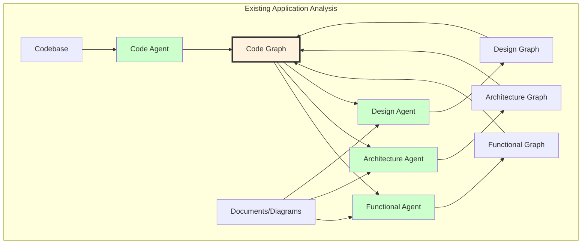
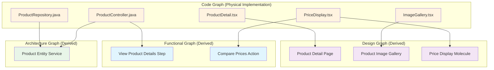
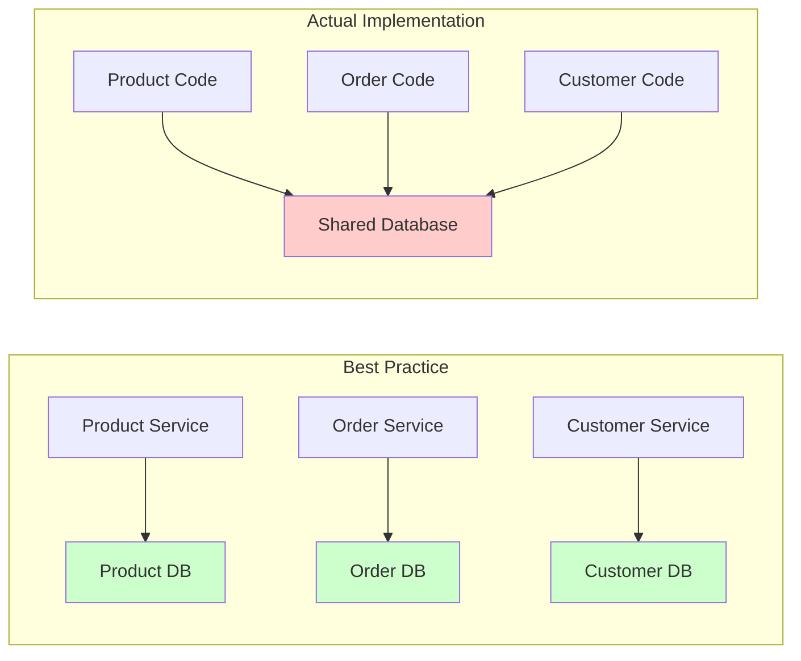
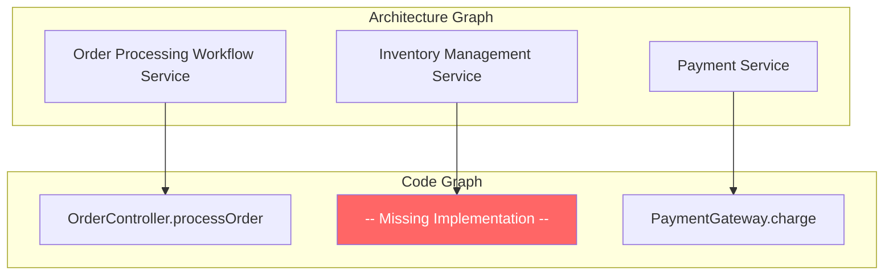
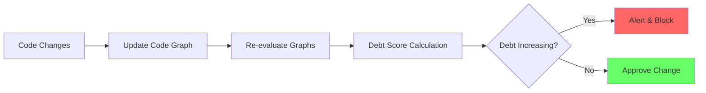

# Breeze.AI Code Graph Analysis and Technical Debt Assessment

## The Code Graph as the Central Connector

The code graph serves as the foundational reality from which all other ontologies are derived when analyzing existing applications. This represents a fundamental shift from traditional documentation-first approaches to a code-first semantic understanding.



## The Four-Agent Extraction Process

### Step 1: Code Graph Generation

The Code Agent analyzes the actual codebase to create a comprehensive code graph following the code ontology:

```
Code Graph Example:
├── Frontend Code
│   ├── E-commerce Web App (React)
│   │   ├── ProductModule
│   │   │   ├── ProductListComponent
│   │   │   │   ├── fetchProducts()
│   │   │   │   ├── renderProductGrid()
│   │   │   │   └── products[] state
│   │   │   └── ProductService
│   │   │       ├── getProductById()
│   │   │       └── searchProducts()
│   └── Admin Dashboard (Vue)
│       └── ReportingModule
│           └── SalesReportComponent
├── Backend Code
│   ├── Product API Service (Node.js)
│   │   ├── ProductController
│   │   │   ├── GET /products
│   │   │   └── POST /products
│   │   └── ProductRepository
│   │       ├── findAll()
│   │       └── save()
│   └── Order Service (Java)
│       ├── OrderController
│       └── OrderRepository
```

### Step 2: Pattern Recognition and Mapping

The three ontology agents then analyze the code graph to identify patterns and map them to their respective ontologies:

#### Architecture Agent Analysis

The Architecture Agent examines code structure to map the complete architecture hierarchy:

```
Architecture Graph Extraction from Code:

1. Layer Identification (from deployment structure and dependencies):
   ├── User Experience Layer
   │   ├── Web Frontend ← FROM CODE GRAPH: /web directory
   │   ├── Mobile App ← FROM CODE GRAPH: /mobile directory
   │   └── Admin Dashboard ← FROM CODE GRAPH: /admin directory
   │
   ├── API Gateway Layer
   │   ├── Customer API Gateway ← FROM CODE GRAPH: api-gateway service
   │   └── Admin API Gateway ← FROM CODE GRAPH: admin-gateway service
   │
   ├── Agents Layer (from orchestration and workflow code)
   │   ├── Business Process Agents
   │   │   ├── Purchase Completion Agent ← FROM CODE GRAPH: PurchaseOrchestrator.java
   │   │   └── Order Fulfillment Agent ← FROM CODE GRAPH: FulfillmentWorkflow.java
   │   ├── Domain Agents
   │   │   ├── Product Discovery Agent ← FROM CODE GRAPH: ProductRecommendationService.java
   │   │   └── Pricing Optimization Agent ← FROM CODE GRAPH: DynamicPricingService.java
   │   └── Integration Agents
   │       └── Payment Gateway Agent ← FROM CODE GRAPH: PaymentIntegrationService.java
   │
   ├── Services Layer
   │   ├── Custom Services
   │   │   ├── Entity Services
   │   │   │   ├── Product Entity Service [DERIVED NODE]
   │   │   │   │   ← FROM CODE GRAPH: ProductController.java
   │   │   │   │   ← FROM CODE GRAPH: ProductRepository.java
   │   │   │   │   ← FROM CODE GRAPH: ProductModel.java
   │   │   │   ├── Customer Entity Service [DERIVED NODE]
   │   │   │   │   ← FROM CODE GRAPH: CustomerController.java
   │   │   │   │   ← FROM CODE GRAPH: CustomerRepository.java
   │   │   │   └── Order Entity Service [DERIVED NODE]
   │   │   │       ← FROM CODE GRAPH: OrderController.java
   │   │   │       ← FROM CODE GRAPH: OrderRepository.java
   │   │   │
   │   │   ├── Workflow Services
   │   │   │   ├── Order Processing Workflow [DERIVED NODE]
   │   │   │   │   ← FROM CODE GRAPH: OrderProcessingService.java
   │   │   │   └── Return Processing Workflow [DERIVED NODE]
   │   │   │       ← FROM CODE GRAPH: ReturnService.java
   │   │   │
   │   │   └── Integration Services
   │   │       ├── Payment Gateway Integration [DERIVED NODE]
   │   │       │   ← FROM CODE GRAPH: StripeIntegrationService.java
   │   │       └── Shipping Provider Integration [DERIVED NODE]
   │   │           ← FROM CODE GRAPH: FedExIntegrationService.java
   │   │
   │   └── Platform Services (shared across multiple domains)
   │       ├── Authentication Service [DERIVED NODE]
   │       │   ← FROM CODE GRAPH: AuthController.java
   │       │   ← FROM CODE GRAPH: JWTService.java
   │       ├── Search Service [DERIVED NODE]
   │       │   ← FROM CODE GRAPH: ElasticsearchService.java
   │       └── Notification Service [DERIVED NODE]
   │           ← FROM CODE GRAPH: NotificationService.java
```

**Code-to-Architecture Mapping Example:**

```java
// CODE GRAPH NODES:
// Backend Code > Product API Service > ProductModule > ProductController.java
@RestController
@RequestMapping("/api/products")
public class ProductController {
    @Autowired
    private ProductRepository repository;
    
    @GetMapping
    public List<Product> getAllProducts() { }
    
    @PostMapping
    public Product createProduct(@RequestBody Product product) { }
}

// Backend Code > Product API Service > ProductModule > ProductRepository.java
@Repository
public interface ProductRepository extends JpaRepository<Product, Long> { }

// Backend Code > Product API Service > ProductModule > Product.java
@Entity
public class Product { }

// DERIVED ARCHITECTURE GRAPH:
Layer: Services Layer
└── Service Type: Custom Services
    └── Category: Entity Services
        └── Service: Product Entity Service [DERIVED NODE]
            ├── Maps to CODE GRAPH: ProductController.java
            ├── Maps to CODE GRAPH: ProductRepository.java
            └── Maps to CODE GRAPH: Product.java
```

#### Functional Agent Analysis

The Functional Agent analyzes code to extract the complete functional hierarchy:

```
Functional Graph Extraction from Code:

1. Persona Identification (from user roles, authentication, permissions):
   Code: UserRole.CUSTOMER, UserRole.ADMIN, UserRole.VENDOR
   ├── E-commerce Shopper (identified from customer-facing controllers)
   ├── System Administrator (identified from admin routes and permissions)
   └── Vendor Partner (identified from vendor API endpoints)

2. Outcome Discovery (from major feature modules and API groups):
   E-commerce Shopper:
   ├── Complete Purchase (from OrderController, PaymentService)
   ├── Manage Account (from UserController, ProfileService)
   └── Track Orders (from OrderTrackingController)
   
   System Administrator:
   ├── Monitor System Health (from MonitoringController, MetricsService)
   ├── Manage Users (from UserManagementController)
   └── Generate Reports (from ReportingService)

3. Scenario Extraction (from method variations and conditional logic):
   Complete Purchase:
   ├── Buy Single Item (from checkout() method)
   ├── Buy Multiple Items (from bulkCheckout() method)
   ├── Buy with Discount Code (from checkoutWithCoupon() method)
   └── Guest Checkout (from guestCheckout() method)

4. Steps Identification (from method call sequences):
   Buy Single Item Scenario:
   ├── Search Products (from ProductController.search())
   ├── View Product Details (from ProductController.getDetails())
   ├── Add to Cart (from CartController.addItem())
   ├── Review Cart (from CartController.view())
   └── Complete Payment (from PaymentController.process())

5. Actions Extraction (from atomic methods and UI interactions):
   Search Products Step:
   ├── Enter Search Term (from searchInput handler)
   ├── Apply Filters (from filterProducts() method)
   ├── Sort Results (from sortProducts() method)
   └── View Results (from renderProductList() method)
```

**Code-to-Functional Mapping Example:**

```javascript
// CODE GRAPH NODE:
// Backend Code > Product API Service > ProductModule > ProductController > searchProducts()
class ProductController {
  async searchProducts(req, res) {
    const { query, filters, sort } = req.body;
    // ... implementation
  }
}

// DERIVED FUNCTIONAL GRAPH:
Persona: E-commerce Shopper
└── Outcome: Find Desired Products
    └── Scenario: Search with Filters
        └── Step: Search Products
            ├── Action: Enter Search Term ← MAPPED FROM: ProductController.searchProducts().query
            ├── Action: Apply Filters ← MAPPED FROM: ProductController.searchProducts().filters
            └── Action: Sort Results ← MAPPED FROM: ProductController.searchProducts().sort
```

#### Design Agent Analysis

The Design Agent maps UI code to the complete design hierarchy:

```
Design Graph Extraction from Code:

1. User Journey Identification (from navigation flows and user session patterns):
   ├── Customer Shopping Journey [DERIVED NODE]
   │   └── Spans: Landing → Browse → Purchase → Post-Purchase
   ├── Admin Management Journey [DERIVED NODE]
   │   └── Spans: Login → Dashboard → Manage → Report
   └── Vendor Onboarding Journey [DERIVED NODE]
       └── Spans: Registration → Verification → Setup → Operations

2. Flow Discovery (from route definitions and page transitions):
   Customer Shopping Journey:
   ├── Product Discovery Flow [DERIVED NODE]
   │   └── Routes: /home → /search → /products → /product/:id
   │       ← FROM CODE GRAPH: routes.tsx
   ├── Purchase Flow [DERIVED NODE]
   │   └── Routes: /cart → /checkout → /payment → /confirmation
   │       ← FROM CODE GRAPH: routes.tsx
   └── Account Management Flow [DERIVED NODE]
       └── Routes: /profile → /orders → /settings
           ← FROM CODE GRAPH: routes.tsx

3. Page Extraction (from route components and page-level components):
   Product Discovery Flow:
   ├── Home Page [DERIVED NODE] ← FROM CODE GRAPH: HomePage.tsx
   ├── Search Results Page [DERIVED NODE] ← FROM CODE GRAPH: SearchResults.tsx
   ├── Product Listing Page [DERIVED NODE] ← FROM CODE GRAPH: ProductList.tsx
   └── Product Detail Page [DERIVED NODE] ← FROM CODE GRAPH: ProductDetail.tsx

4. Template Identification (from layout patterns in pages):
   Product Detail Page:
   └── Two-Column Detail Template [DERIVED NODE]
       ├── Left: Media Section
       └── Right: Information Section

5. Organism Mapping (from complex component groups):
   Two-Column Detail Template:
   ├── Product Image Gallery [DERIVED NODE] ← FROM CODE GRAPH: ImageGallery.tsx
   ├── Product Information Panel [DERIVED NODE] ← FROM CODE GRAPH: ProductInfo.tsx
   ├── Add to Cart Section [DERIVED NODE] ← FROM CODE GRAPH: AddToCart.tsx
   └── Reviews Section [DERIVED NODE] ← FROM CODE GRAPH: ReviewsList.tsx

6. Molecule Extraction (from composite components):
   Add to Cart Section:
   ├── Quantity Selector [DERIVED NODE] ← FROM CODE GRAPH: QuantityPicker.tsx
   ├── Size Selector [DERIVED NODE] ← FROM CODE GRAPH: SizeSelector.tsx
   ├── Add to Cart Button Group [DERIVED NODE] ← FROM CODE GRAPH: CartActions.tsx
   └── Price Display [DERIVED NODE] ← FROM CODE GRAPH: PriceInfo.tsx

7. Atom Identification (from basic UI elements):
   Add to Cart Button Group:
   ├── Primary Button [DERIVED NODE] ← FROM CODE GRAPH: Button.tsx (variant="primary")
   ├── Icon [DERIVED NODE] ← FROM CODE GRAPH: CartIcon.tsx
   └── Loading Spinner [DERIVED NODE] ← FROM CODE GRAPH: Spinner.tsx
```

**Code-to-Design Mapping Example:**

```typescript
// CODE GRAPH NODES:
// Frontend Code > E-commerce Web App > ProductModule > Components > ProductDetail.tsx
const ProductDetail = () => {
  return (
    <PageLayout>
      <div className="product-detail-grid">
        <ImageGallery images={product.images} />
        <div className="product-info">
          <ProductTitle>{product.name}</ProductTitle>
          <PriceDisplay price={product.price} />
          <SizeSelector sizes={product.sizes} />
          <QuantityPicker />
          <AddToCartButton productId={product.id} />
          <ReviewsList reviews={product.reviews} />
        </div>
      </div>
    </PageLayout>
  );
};

// DERIVED DESIGN GRAPH:
User Journey: Customer Shopping Journey [DERIVED NODE]
└── Flow: Product Discovery Flow [DERIVED NODE]
    └── Page: Product Detail Page [DERIVED NODE]
        ├── Maps to CODE GRAPH: ProductDetail.tsx
        └── Template: Two-Column Detail Template [DERIVED NODE]
            └── Organism: Product Information Panel [DERIVED NODE]
                ├── Maps to CODE GRAPH: ProductInfo.tsx
                ├── Molecule: Price Display [DERIVED NODE]
                │   └── Maps to CODE GRAPH: PriceDisplay.tsx
                ├── Molecule: Size Selector [DERIVED NODE]
                │   └── Maps to CODE GRAPH: SizeSelector.tsx
                ├── Molecule: Quantity Picker [DERIVED NODE]
                │   └── Maps to CODE GRAPH: QuantityPicker.tsx
                └── Molecule: Add to Cart Button [DERIVED NODE]
                    ├── Maps to CODE GRAPH: AddToCartButton.tsx
                    └── Atom: Primary Button [DERIVED NODE]
                        └── Maps to CODE GRAPH: Button.tsx
```

### Mapping Relationships Summary



### Step 3: Document Enhancement

If available, the agents also analyze existing documents and diagrams to enhance and validate the extracted graphs:

- Architecture documents → Validate and refine Architecture Graph
- User stories → Enhance Functional Graph
- Design systems → Confirm Design Graph patterns

## Technical Debt Assessment Framework

Once the knowledge graphs are generated and connected through the code graph, Breeze.AI can systematically assess technical debt by comparing the actual implementation against best practice ontologies.

### Architecture Best Practice Validation

#### Microservices Separation Analysis



**Technical Debt Score**: High - Shared database violates microservices principles

#### Service Independence Metrics

|Validation Rule|Description|Assessment Method|
|---|---|---|
|**Data Store Isolation**|Each entity service should have independent persistence|Check database connections per service|
|**API Boundary Clarity**|Services communicate only through defined APIs|Analyze direct code dependencies|
|**Deployment Independence**|Services can be deployed separately|Check shared libraries and build dependencies|
|**Domain Boundary Integrity**|No business logic leakage between services|Analyze cross-service method calls|

### Design Best Practice Validation

#### Component Reuse Analysis

```
Design Debt Detection:
├── Multiple Login Form Implementations (4 found)
│   ├── CustomerLoginForm.tsx
│   ├── AdminAuthComponent.vue
│   ├── PartnerLogin.js
│   └── MobileLoginScreen.tsx
│   
└── Recommendation: Consolidate to single Login organism
    └── Estimated Impact: 3,200 lines of redundant code
```

#### Design System Compliance

|Pattern|Expected|Found|Compliance|Technical Debt|
|---|---|---|---|---|
|Button Variants|3|12|25%|High - Inconsistent UX|
|Form Validation|1 pattern|5 patterns|20%|High - Maintenance burden|
|Data Tables|2 types|8 implementations|25%|Medium - Feature drift|
|Navigation|1 pattern|3 patterns|33%|Medium - User confusion|

### Functional Coverage Analysis

#### Missing Implementation Detection

```
Functional Actions without Code Implementation:
├── "Export Report as PDF" → No implementing code found
├── "Schedule Recurring Order" → Partial implementation only
├── "Compare Products Side-by-Side" → UI exists but no backend
└── "Bulk Import Products" → API exists but no UI
```

### Cross-Ontology Consistency Validation

#### Architecture-Code Alignment



**Technical Debt**: Inventory Management Service defined in architecture but not implemented

#### Design-Code Synchronization

```
Design Component Status:
├── Implemented & Aligned: 67%
├── Implemented but Divergent: 23%
├── Design Only (No Code): 8%
└── Code Only (No Design): 12%

Divergence Examples:
- ProductCard design shows 5 elements, code implements 3
- Navigation design specifies mega-menu, code uses simple dropdown
- Form validation design requires inline errors, code uses popup alerts
```

## Technical Debt Quantification

### Debt Scoring Matrix

|Category|Measurement|Score|Impact|
|---|---|---|---|
|**Architecture Violations**|Services sharing databases|8/10|High - Scaling limitations|
|**Design Inconsistency**|UI pattern variations|6/10|Medium - Maintenance cost|
|**Functional Gaps**|Unimplemented features|4/10|Medium - User experience|
|**Code Duplication**|Repeated implementations|7/10|High - Bug propagation risk|
|**Cross-Ontology Misalignment**|Specification drift|9/10|Critical - Systemic issues|

### Prioritized Remediation Plan

Based on the technical debt assessment, Breeze.AI can generate a prioritized remediation plan:

```
Technical Debt Remediation Priority:
1. Database Separation (Architecture)
   - Impact: Enables independent scaling
   - Effort: 3-4 sprints
   - Risk: High (data migration required)

2. Design System Consolidation (Design)
   - Impact: 40% reduction in UI code
   - Effort: 2-3 sprints
   - Risk: Low (incremental migration possible)

3. Service Boundary Enforcement (Architecture)
   - Impact: Improved maintainability
   - Effort: 2 sprints
   - Risk: Medium (API changes required)

4. Functional Gap Closure (Functional)
   - Impact: Complete feature parity
   - Effort: 1-2 sprints per feature
   - Risk: Low (additive changes only)
```

## Evolution Tracking

### Continuous Debt Monitoring



### Debt Prevention Rules

1. **New Code Validation**: Every code commit is validated against ontologies
2. **Pattern Compliance**: New components must use approved patterns
3. **Architecture Adherence**: Services must maintain independence
4. **Design Consistency**: UI changes must align with design system
5. **Functional Completeness**: Features must fully implement specified actions

## The Power of Code-Centric Graph Analysis

By making the code graph the central connector:

1. **Ground Truth**: Code represents the actual system behavior, not intended behavior
2. **Bidirectional Validation**: Can validate both code→specification and specification→code
3. **Precise Impact Analysis**: Changes in any ontology immediately show code impact
4. **Automated Remediation**: Agents can generate code to fix identified debt
5. **Continuous Compliance**: Every change is evaluated against best practices

This approach transforms technical debt from an abstract concept to a measurable, manageable metric with clear remediation paths.