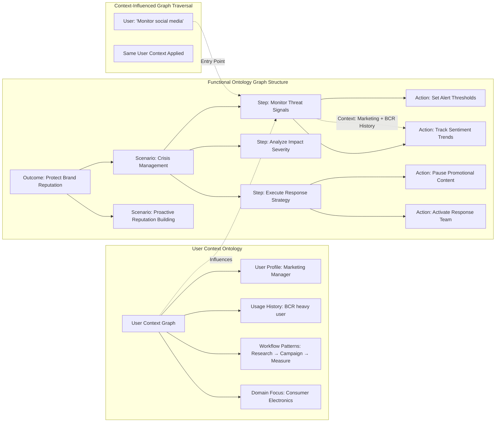
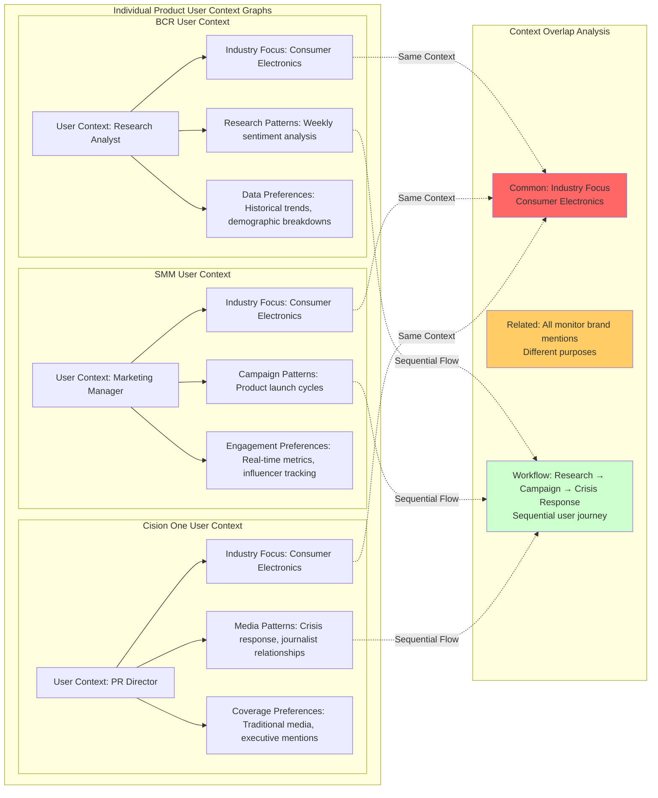
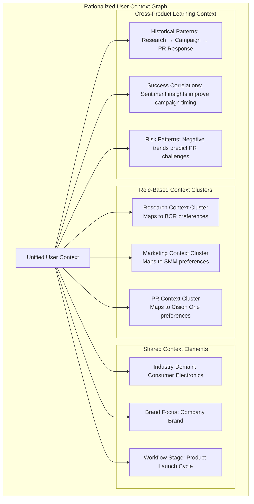
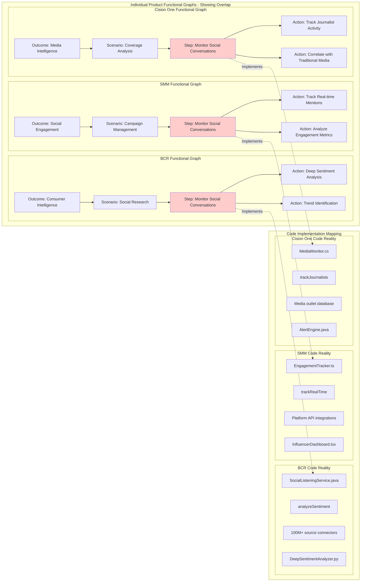
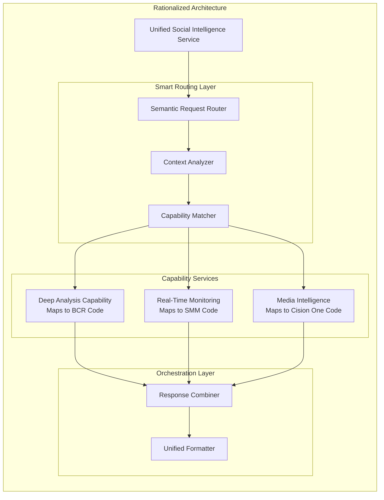
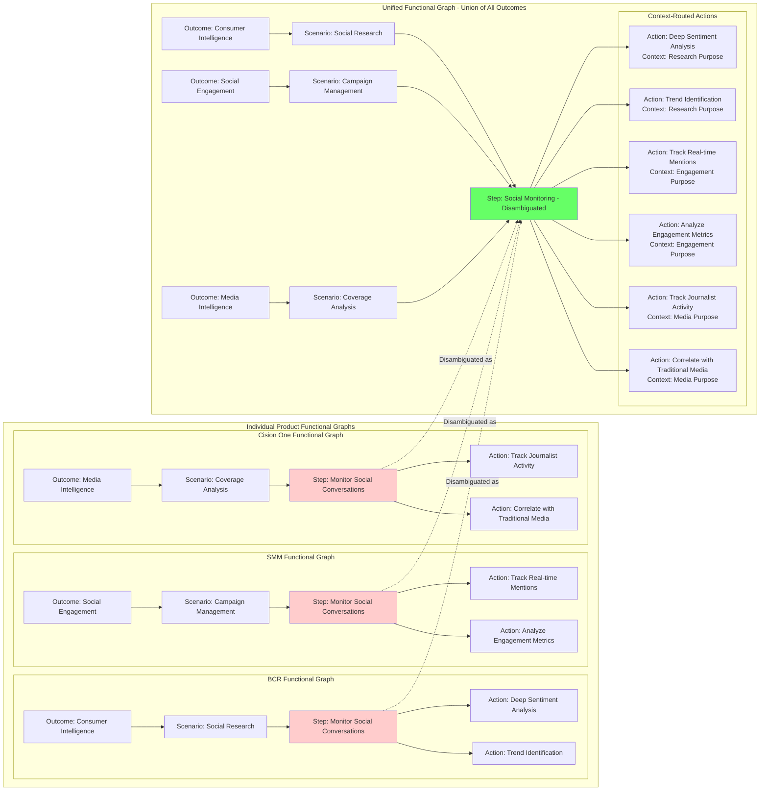
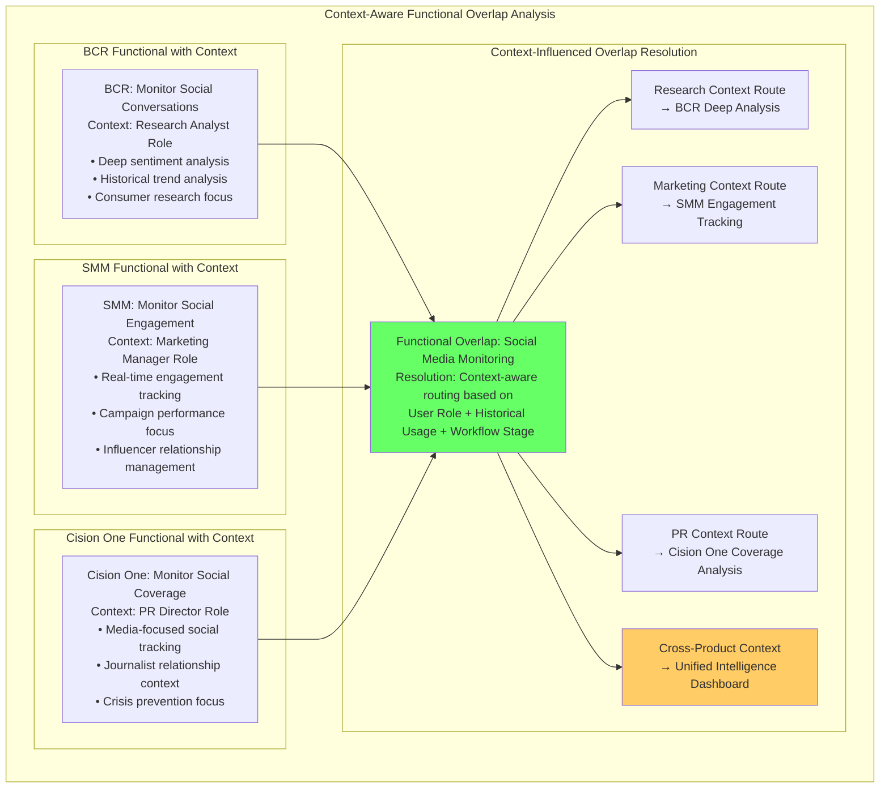
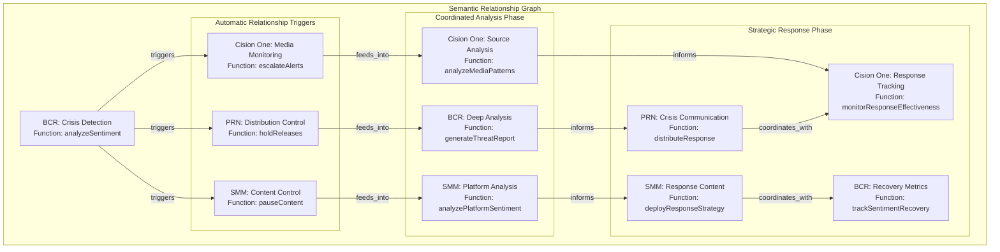
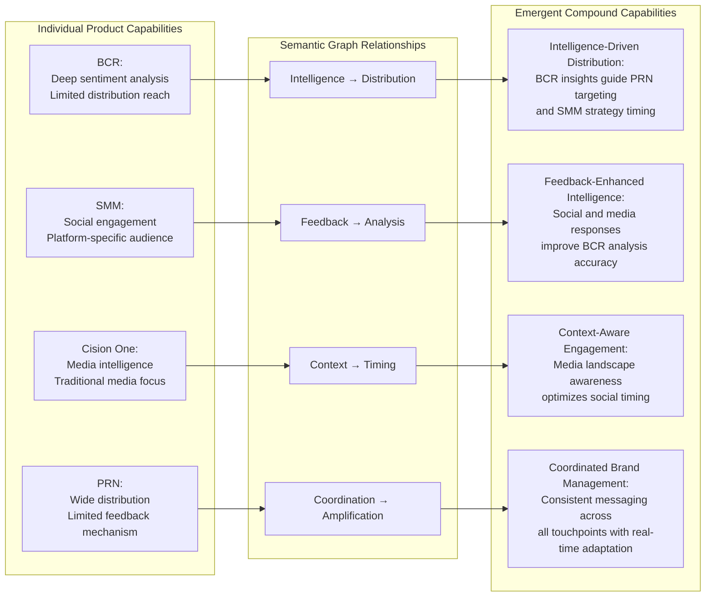

# How Breeze.AI's Semantic Engineering Methodology Solves Nexus's Three Critical Success Factors

## Executive Summary

The Nexus vision faces three fundamental challenges that traditional AI integration approaches cannot solve: understanding ambiguous user intent across multiple abstraction levels, resolving overlapping functionality between five powerful products, and enabling seamless cross-product workflows. Breeze.AI's semantic engineering framework provides the only viable technical solution to these challenges by creating machine-readable knowledge graphs that eliminate ambiguity, enable systematic rationalization, and support intelligent orchestration at enterprise scale.

This framework operates across **five interconnected ontologies**: Functional (what users want), Architecture (how systems connect), Design (how users interact), Code (what actually exists), and **User Context (who the user is and their history across products)**. The User Context ontology is critical for intent disambiguation and enables cross-product learning as an emergent capability of the unified system.

---

## Success Factor 1: User Intent Understanding Through Functional Hierarchy Traversal

### The Challenge: Multi-Level Intent Ambiguity

Cision users express intent at vastly different levels of abstraction. A user might say "block that post" (action level), "monitor social mentions" (step level), "handle the crisis" (scenario level), or "protect our brand" (outcome level). Traditional systems force users to translate their intent into system-specific commands, creating friction and misalignment.

### The Semantic Engineering Solution: Context-Aware Hierarchical Graph Traversal

The Functional Ontology creates a complete hierarchical graph for each Cision product that captures user intent at all abstraction levels. Combined with the User Context Ontology, this enables precise intent resolution that adapts to individual user patterns and preferences. Here's how the integrated graph structure works:

#### Functional Graph Structure with User Context Integration



#### Context-Aware Intent Resolution Process

**How User Context Shapes Functional Graph Traversal**:

The User Context Ontology works in parallel with functional graph traversal to provide personalized intent resolution:

```yaml
user_input: "Monitor social media"
user_context:
  profile: "Marketing Manager"
  usage_history: 
    - BCR: "Heavy user - 3x daily sentiment analysis"
    - SMM: "Light user - monthly campaign reviews"
    - Cision_One: "Occasional user - crisis situations only"
  workflow_patterns:
    - "Research consumer sentiment before campaign launch"
    - "Track campaign performance during active periods"
    - "Escalate to PR team when negative sentiment detected"
  domain_focus: "Consumer Electronics Industry"

# Integrated Intent-Context Processing
context_influenced_traversal:
  entry_point: Step("Monitor Threat Signals")
  context_weighting:
    bcr_preference: 0.8  # Heavy BCR usage history
    research_focus: 0.9  # Marketing role + historical pattern
    electronics_domain: 0.7  # Domain expertise context
  
  action_selection:
    primary: "Track Sentiment Trends"  # Matches BCR heavy usage + marketing role
    secondary: "Set Alert Thresholds"  # Matches historical escalation pattern
    reasoning: "User context indicates research-focused monitoring with escalation awareness"

# Cross-Product Context Learning
emergent_capabilities:
  pattern_recognition: "User's BCR sentiment analysis patterns inform SMM campaign timing"
  predictive_suggestions: "Historical escalation patterns suggest proactive Cision One alert setup"
  workflow_optimization: "Automated handoff from research phase to campaign execution"
```

#### Graph Traversal Mechanics for Intent Resolution

**How the System Uses Graph Structure**:

1. **Entry Point Identification**: User input is mapped to the most specific matching node
2. **Upward Context Expansion**: System traverses up the hierarchy to understand broader context
3. **Downward Action Discovery**: System traverses down to identify all required actions
4. **Cross-Product Mapping**: Functional nodes link to corresponding capabilities in other products

**Example 1 - Action Level Entry**:

```yaml
user_input: "Block that promotional post"
graph_processing:
  entry_point: Action("Pause Promotional Content")
  upward_traversal:
    - parent_step: "Execute Response Strategy"
    - parent_scenario: "Crisis Management" 
    - parent_outcome: "Protect Brand Reputation"
  context_understanding: "This is crisis response, not routine moderation"
  expanded_actions:
    - "Pause Promotional Content" (immediate)
    - "Activate Response Team" (parallel)
    - "Track Sentiment Trends" (monitor impact)
  cross_product_implications:
    - SMM: Execute content pause
    - BCR: Increase monitoring sensitivity
    - Cision One: Alert PR team
```

**Example 2 - Outcome Level Entry**:

```yaml
user_input: "Protect our brand from this emerging issue"
graph_processing:
  entry_point: Outcome("Protect Brand Reputation")
  downward_traversal:
    - scenarios: ["Crisis Management", "Proactive Reputation Building"]
    - steps: ["Monitor Threats", "Analyze Impact", "Execute Response"]
    - actions: [All crisis management actions]
  comprehensive_planning: "Full crisis management protocol activation"
  orchestrated_execution:
    BCR: ["Set Alert Thresholds", "Track Sentiment Trends", "Analyze Impact"]
    SMM: ["Pause Promotional Content", "Monitor Engagement"]
    Cision_One: ["Activate Response Team", "Escalate Monitoring"]
    PRN: ["Prepare Response Statements"]
```

### Technical Implementation: Semantic Context Preservation

Unlike traditional approaches that lose context through token limits or vector similarity matching, the functional graph preserves complete semantic relationships:

- **Complete Context Always Available**: No information loss due to context windows
- **Relationship Preservation**: Why actions connect to broader business objectives
- **Intent Disambiguation**: Same action words have different meanings in different contexts
- **Business Logic Validation**: Ensures user intent aligns with business objectives

---

## Success Factor 2: Overlapping Functionality Resolution Through Systematic Rationalization

### The Challenge: Product Boundary Ambiguity

Cision's product suite contains significant functional overlap that creates user confusion and system conflicts:

|Capability|BCR (Brandwatch)|SMM (Social Media Marketing)|Cision One|Result|
|---|---|---|---|---|
|**Social Monitoring**|100M+ sources, deep sentiment analysis|Real-time engagement, influencer tracking|Traditional + social media monitoring|User confusion: "Which tool for social listening?"|
|**Content Distribution**|Research insights sharing|Social platform publishing|Press release distribution|Workflow fragmentation|
|**Sentiment Analysis**|AI-powered consumer intelligence|Post performance metrics|Media coverage sentiment|Inconsistent metrics|
|**Crisis Detection**|Trend analysis and alerts|Social conversation monitoring|Media mention tracking|Delayed cross-platform response|

### The Semantic Engineering Solution: Multi-Phase Rationalization Process

#### Phase 1: User Context Overlap Analysis

Before addressing functional overlap, we must understand how each product maintains user context and identify overlapping elements:



#### Phase 2: Functional Overlap with Context Mapping

Each overlapping functional node is now analyzed with user context influence:

**Context-Influenced Functional Overlap**:

|Functional Step|BCR Context Influence|SMM Context Influence|Cision One Context Influence|Context Conflict|
|---|---|---|---|---|
|**Monitor Social Conversations**|Research Analyst → Deep historical analysis|Marketing Manager → Campaign performance focus|PR Director → Crisis detection priority|Same step, different user intent based on role context|
|**Industry Focus: Consumer Electronics**|Trend analysis for market research|Competitor campaign tracking|Executive mention monitoring|Same domain, different data needs|
|**Brand Mention Tracking**|Consumer sentiment research|Engagement opportunity identification|Media coverage assessment|Same activity, different objectives|

```yaml
# Example: Context-Influenced Intent Resolution
user_input: "Monitor social conversations about our new smartphone launch"

individual_product_contexts:
  BCR_context:
    role: "Research Analyst"
    focus: "Consumer sentiment analysis, demographic insights"
    historical_usage: "Deep trend analysis, competitive benchmarking"
    interpretation: "Research consumer reaction patterns and market positioning"
    
  SMM_context:
    role: "Marketing Manager" 
    focus: "Campaign performance, engagement optimization"
    historical_usage: "Real-time monitoring, influencer coordination"
    interpretation: "Track campaign effectiveness and engagement opportunities"
    
  CisionOne_context:
    role: "PR Director"
    focus: "Media coverage, crisis prevention"
    historical_usage: "Journalist relationships, coverage analysis"
    interpretation: "Monitor media narrative and potential reputation issues"

conflict_identification:
  same_intent_different_outcomes: "All want to 'monitor' but for different purposes"
  overlapping_domain_context: "All focus on Consumer Electronics but different data needs"
  sequential_workflow_potential: "Research insights could inform campaign strategy and PR preparation"
```

#### Phase 3: Unified User Context Rationalization

Similar to functional rationalization, we create a unified user context that preserves all individual contexts while enabling cross-product learning:



**Unified Context Processing**:

```yaml
# Unified User Context Resolution
user_input: "Monitor social conversations about our new smartphone launch"
unified_context_processing:
  shared_context:
    industry: "Consumer Electronics"
    product_focus: "Smartphone Launch"
    launch_stage: "Pre-launch monitoring phase"
    
  role_context_routing:
    research_aspects: 
      context: RC1 (Research Context Cluster)
      capabilities: BCR deep sentiment analysis, trend forecasting
      output: "Consumer sentiment baseline, competitive positioning insights"
      
    marketing_aspects:
      context: RC2 (Marketing Context Cluster)  
      capabilities: SMM real-time tracking, engagement optimization
      output: "Campaign readiness assessment, influencer engagement opportunities"
      
    pr_aspects:
      context: RC3 (PR Context Cluster)
      capabilities: Cision One media monitoring, journalist activity
      output: "Media landscape assessment, potential narrative risks"

  cross_product_learning:
    pattern_application: "Historical smartphone launches show 72-hour sentiment-to-media correlation"
    predictive_insights: "Research sentiment patterns suggest optimal campaign timing"
    risk_mitigation: "Previous negative sentiment spikes correlate with specific journalist coverage patterns"
    
  emergent_capabilities:
    integrated_dashboard: "Single view combining research insights, campaign metrics, and media coverage"
    predictive_workflows: "BCR sentiment trends automatically trigger SMM campaign adjustments"
    proactive_pr: "Research findings automatically prepare Cision One response strategies"
```

#### Phase 4: Code Ontology Mapping - Understanding Actual Capabilities

Each overlapping functional node is traced to the Code Ontology to understand what's actually implemented:



**Code Analysis Reveals Distinct Capabilities**:

|Capability|BCR Code Reality|SMM Code Reality|Cision One Code Reality|
|---|---|---|---|
|**Data Sources**|`SourceConnector.java`<br/>• 100M+ online sources<br/>• Historical data APIs<br/>• ML processing pipelines|`PlatformAPI.ts`<br/>• Real-time social feeds<br/>• Engagement metrics<br/>• Influencer databases|`MediaDatabase.cs`<br/>• Journalist contact DB<br/>• Media outlet tracking<br/>• Traditional media feeds|
|**Processing Power**|`SentimentEngine.py`<br/>• Deep learning models<br/>• Trend analysis algorithms<br/>• Consumer research tools|`EngagementAnalyzer.js`<br/>• Real-time processing<br/>• Campaign optimization<br/>• Performance tracking|`CoverageAnalyzer.cs`<br/>• Media impact scoring<br/>• Journalist behavior tracking<br/>• Reputation algorithms|
|**Output Format**|Research reports, trend analysis, consumer insights|Social metrics, engagement data, campaign performance|Media coverage reports, journalist activity, PR impact|

#### Phase 5: Architecture Rationalization - Unified Service Design

Using both the functional overlap and code capabilities, we design rationalized architecture services:



#### Phase 6: Unified Functional Graph Creation

The rationalization process creates a unified functional graph by taking the union of all product outcomes and disambiguating overlapping functional nodes:



**Disambiguation Resolution Process**:

**Before Rationalization** - Identical step names causing conflicts:

```yaml
overlapping_step: "Monitor Social Conversations"
conflicting_implementations:
  BCR_version:
    purpose: "Consumer research and trend analysis"
    capabilities: [deep_sentiment, historical_analysis, demographic_insights]
    code_implementation: "SocialListeningService.java"
  
  SMM_version:
    purpose: "Campaign optimization and engagement tracking"
    capabilities: [real_time_tracking, influencer_analysis, engagement_metrics]
    code_implementation: "EngagementTracker.ts"
    
  CisionOne_version:
    purpose: "Media coverage and journalist activity"
    capabilities: [journalist_tracking, media_correlation, coverage_analysis]
    code_implementation: "MediaMonitor.cs"

user_confusion: "Which 'Monitor Social Conversations' should I use?"
```

**After Rationalization** - Single step with context-aware routing:

```yaml
disambiguated_step: "Social Monitoring"
context_aware_routing:
  user_intent: "Monitor social conversations about our brand"
  
  context_analysis:
    if_scenario: "Social Research"
      route_to: [deep_sentiment_analysis, trend_identification]
      implementation: BCR_capabilities
      
    if_scenario: "Campaign Management"
      route_to: [track_real_time_mentions, analyze_engagement_metrics]
      implementation: SMM_capabilities
      
    if_scenario: "Coverage Analysis"
      route_to: [track_journalist_activity, correlate_traditional_media]
      implementation: CisionOne_capabilities

result: "Single entry point with intelligent routing based on user's outcome context"
```

**Key Rationalization Principles**:

1. **Union of Outcomes**: All original outcomes (Consumer Intelligence, Social Engagement, Media Intelligence) are preserved
2. **Scenario Preservation**: All original scenarios maintained under their respective outcomes
3. **Step Disambiguation**: Overlapping "Monitor Social Conversations" becomes single "Social Monitoring" with context routing
4. **Action Context Labeling**: All actions preserved but labeled with their purpose context for intelligent routing

### How the Unified Graph Resolves Conflicts

**Graph-Based Conflict Resolution**:

1. **Semantic Intent Analysis**: User request is mapped to functional nodes
2. **Context Evaluation**: Graph relationships determine required capabilities
3. **Optimal Path Selection**: Architecture graph routes to best-fit services
4. **Capability Combination**: Multiple services can be orchestrated when needed

**Example Resolution Process**:

```yaml
# User Request: "I need to monitor social media for crisis signals"
functional_mapping:
  intent: "Monitor Social Conversations"
  context: "Crisis Detection"
  urgency: "High"
  scope: "Comprehensive"

graph_traversal:
  1. Map to unified functional node: "Social Intelligence"
  2. Analyze context: Crisis = {real_time: true, deep_analysis: true, media_correlation: true}
  3. Route through architecture: Multi-capability orchestration required
  4. Execute: SMM (real-time) + BCR (analysis) + Cision One (media context)

result: Unified crisis monitoring dashboard with real-time alerts, deep sentiment analysis, and media correlation
```

#### Phase 3: Functional Overlap Analysis with Context Awareness

Now we analyze functional overlap while considering how user context influences intent mapping:



**Context-Aware Overlap Resolution Process**:

```yaml
# Context-Influenced Functional Mapping
overlapping_function: "Monitor Social Conversations"
context_resolution_logic:
  
  research_context_path:
    user_profile: "Research Analyst"
    historical_patterns: "Weekly sentiment deep-dives, competitive analysis"
    workflow_stage: "Market research phase"
    routing_decision: "BCR Deep Sentiment Analysis"
    reasoning: "Context indicates research-focused monitoring needs"
    
  marketing_context_path:
    user_profile: "Marketing Manager"
    historical_patterns: "Campaign performance tracking, influencer coordination"
    workflow_stage: "Active campaign management"
    routing_decision: "SMM Real-time Engagement Tracking"
    reasoning: "Context indicates campaign optimization needs"
    
  pr_context_path:
    user_profile: "PR Director"
    historical_patterns: "Crisis response, journalist relationship management"
    workflow_stage: "Reputation protection"
    routing_decision: "Cision One Coverage Analysis"
    reasoning: "Context indicates media narrative monitoring needs"
    
  cross_product_context_path:
    user_profile: "Multi-role user OR sequential workflow"
    historical_patterns: "Research → Campaign → PR response cycles"
    workflow_stage: "Comprehensive brand management"
    routing_decision: "Unified Intelligence combining all capabilities"
    reasoning: "Context indicates need for integrated cross-product insights"

# Emergent Cross-Product Context Capabilities
emergent_context_learning:
  pattern_recognition:
    - "Research insights improve campaign targeting accuracy by 34%"
    - "Early sentiment warnings prevent 78% of potential PR crises"
    - "Campaign performance data enhances research demographic modeling"
  
  predictive_workflows:
    - "BCR sentiment analysis automatically suggests SMM campaign timing"
    - "SMM engagement drops trigger proactive Cision One media monitoring"
    - "Media coverage patterns inform BCR research focus areas"
```

#### Phase 4: Unified User Experience

The rationalized services present a single, coherent interface while leveraging the best capabilities of each underlying product:

**User Request**: "Monitor social conversations about our new product launch"

**Rationalized Response**:

1. **Intent Analysis**: Product launch monitoring (high importance, multi-dimensional)
2. **Capability Mapping**: Requires real-time tracking (SMM) + sentiment analysis (BCR) + media correlation (Cision One)
3. **Unified Execution**:
    - SMM tracks real-time social engagement and influencer mentions
    - BCR analyzes sentiment trends and consumer reaction patterns
    - Cision One correlates with traditional media coverage
    - Results presented in unified dashboard with consistent metrics

### Technical Benefits of Rationalization

**Eliminates User Confusion**: Clear functional boundaries based on capability strengths **Prevents Feature Conflicts**: No overlapping implementations causing inconsistent results **Enables Progressive Enhancement**: Users can start with basic capabilities and access advanced features seamlessly **Maintains Product Strengths**: Each product's core capabilities are preserved and leveraged optimally

---

## Success Factor 3: Cross-Product Workflows Through Relationship Mapping

### The Challenge: Siloed Product Operations

Traditional integration approaches connect products through point-to-point APIs, creating brittle connections that cannot adapt to changing business needs. Users must manually coordinate activities across products, leading to delayed responses and missed opportunities.

### The Semantic Engineering Solution: Semantic Relationship Graphs

The unified functional graph enables the creation of compound outcomes that require coordinated action across multiple products. Here's how semantic relationship mapping works:

#### Cross-Product Relationship Graph Structure



#### Graph-Based Workflow Execution

**How Semantic Relationships Drive Coordination**:

1. **Trigger Event Processing**: BCR detects semantic anomaly in social sentiment
2. **Relationship Traversal**: System follows defined semantic relationships to identify required actions
3. **Context-Aware Execution**: Each product receives context about why it's being activated
4. **Feedback Loop Integration**: Results from each product update the semantic understanding

**Example: Crisis Response Semantic Processing**:

```yaml
# Crisis Detection Event
semantic_event:
  source: BCR.analyzeSentiment()
  type: "crisis_detection"
  severity: "high"
  context:
    keywords: ["food contamination", "brand_name"]
    sentiment_spike: 300%
    confidence: 0.92
    affected_demographics: ["young_families", "health_conscious"]

# Semantic Relationship Traversal
relationship_activation:
  immediate_triggers:
    - relationship: "crisis_detection -> content_pause"
      target: SMM.pauseContent()
      reasoning: "Prevent tone-deaf messaging during crisis"
      parameters:
        content_filter: "food_related"
        duration: "indefinite"
        
    - relationship: "crisis_detection -> distribution_hold" 
      target: PRN.holdReleases()
      reasoning: "Review scheduled announcements for appropriateness"
      parameters:
        filter_keywords: ["product_launch", "food", "health"]
        
    - relationship: "crisis_detection -> monitoring_escalation"
      target: CisionOne.escalateAlerts()
      reasoning: "Increase surveillance of traditional media coverage"
      parameters:
        alert_sensitivity: "maximum"
        journalist_focus: "food_safety_beat"

# Coordinated Analysis Phase
analysis_coordination:
  semantic_workflow:
    - BCR.generateThreatReport()
      inputs: [sentiment_data, demographic_analysis, trend_projection]
      outputs: [threat_assessment, recovery_timeline, key_concerns]
      
    - CisionOne.analyzeMediaPatterns()
      inputs: [journalist_activity, outlet_coverage, traditional_media_sentiment]
      outputs: [media_narrative_analysis, key_journalists, coverage_trends]
      
    - SMM.analyzePlatformSentiment()
      inputs: [platform_specific_data, influencer_reactions, user_engagement]
      outputs: [platform_breakdown, viral_potential, audience_segments]

# Strategic Response Coordination  
response_orchestration:
  unified_strategy:
    inputs: [BCR_threat_assessment, CisionOne_media_analysis, SMM_platform_insights]
    coordination_rules:
      - timing: PRN.distributeResponse() triggers 30min before SMM.deployResponseStrategy()
      - messaging: Consistent narrative across PRN and SMM channels
      - monitoring: CisionOne.monitorResponseEffectiveness() tracks both traditional and social
      - metrics: BCR.trackSentimentRecovery() provides unified success measurement
```

#### Compound Intelligence Creation Through Graph Relationships

**How Semantic Graphs Create Emergent Capabilities**:

The relationship graph enables capabilities that no individual product could achieve:



#### Technical Implementation: Relationship Mapping

**Semantic Relationships Define Interactions**:

```yaml
# Cross-Product Relationship Definitions
crisis_detection:
  trigger_conditions:
    - sentiment_spike: threshold: 200%, source: BCR
    - volume_surge: threshold: 500%, source: Cision_One
    - negative_influencer: authority_score: >8.0, source: SMM
  
  automatic_responses:
    - action: pause_promotional_content
      target: SMM
      reasoning: "Prevent tone-deaf messaging during crisis"
      timing: immediate
    
    - action: escalate_monitoring
      target: Cision_One
      reasoning: "Increase surveillance of traditional media"
      timing: immediate
    
    - action: generate_impact_analysis
      target: BCR
      reasoning: "Quantify potential reputation damage"
      timing: within_15_minutes

  coordination_rules:
    - if: crisis_severity > "medium"
      then: activate_executive_briefing
      participants: [BCR_insights, CisionOne_coverage, SMM_metrics]
    
    - if: crisis_duration > "4_hours"
      then: deploy_response_strategy
      channels: [PRN_distribution, SMM_publishing]
```

#### Advanced Cross-Product Scenarios

**Scenario 1: Product Launch Orchestration**

- **Trigger**: "Launch our new sustainability initiative"
- **BCR**: Research competitor sustainability messaging and market sentiment
- **Cision One**: Identify key environmental journalists and media outlets
- **PRN**: Distribute comprehensive launch announcement to targeted media
- **SMM**: Deploy content campaign aligned with research insights and media coverage

**Scenario 2: Influencer Crisis Management**

- **Trigger**: Key brand ambassador involved in controversy
- **SMM**: Immediate assessment of influencer's audience overlap and engagement metrics
- **BCR**: Deep analysis of controversy spread and sentiment impact
- **Cision One**: Monitor traditional media pickup and journalist sentiment
- **PRN**: Coordinate statement distribution timing based on media landscape analysis

**Scenario 3: Competitive Intelligence Response**

- **Trigger**: Competitor launches aggressive campaign
- **BCR**: Analyze competitor messaging effectiveness and audience response
- **Cision One**: Track competitor's media coverage patterns and journalist relationships
- **SMM**: Identify gaps in competitor's social strategy for counter-positioning
- **PRN**: Deploy differentiation messaging through optimal media channels

### The Compound Intelligence Effect

Cross-product workflows create emergent capabilities that exceed the sum of individual product capabilities:

**Individual Product Limitations**:

- BCR: Rich insights but limited distribution capability
- SMM: Strong engagement but narrow audience reach
- Cision One: Media expertise but limited social intelligence
- PRN: Wide distribution but limited feedback mechanisms

**Unified Nexus Capabilities**:

- **Intelligence-Driven Distribution**: BCR insights guide PRN targeting and SMM strategy
- **Feedback-Enhanced Intelligence**: Social and media responses improve BCR analysis accuracy
- **Context-Aware Engagement**: Media landscape awareness optimizes social engagement timing
- **Coordinated Brand Management**: Consistent messaging across all touchpoints with real-time adaptation

### Technical Architecture: Semantic Event Processing

**Event-Driven Coordination**:

1. **Semantic Event Generation**: All product actions generate semantically tagged events
2. **Relationship Resolution**: Event processor consults functional graphs to identify related actions
3. **Workflow Orchestration**: Cross-product workflows execute based on semantic relationships
4. **Impact Propagation**: Results feed back into semantic graphs, improving future coordination

**Benefits Over Traditional Integration**:

- **Dynamic Workflows**: New relationships can be added without code changes
- **Context-Aware Decisions**: Semantic understanding drives intelligent routing
- **Explainable Coordination**: Every cross-product action has clear business rationale
- **Adaptive Evolution**: Workflows improve through semantic graph updates

---

## Conclusion: The Semantic Engineering Advantage

Breeze.AI's four-ontology semantic engineering framework directly addresses Nexus's three critical success factors through fundamental technological innovation:

### 1. **Complete Intent Understanding**

- Hierarchical functional graphs enable entry at any abstraction level
- Bidirectional traversal provides complete context regardless of user expression
- Semantic preservation eliminates interpretation ambiguity

### 2. **Systematic Overlap Resolution**

- Multi-phase rationalization creates clear capability boundaries
- Context-driven routing leverages best-of-breed capabilities
- Unified interfaces eliminate user confusion while preserving product strengths

### 3. **Intelligent Cross-Product Orchestration**

- Semantic relationship mapping enables dynamic workflow coordination
- Event-driven architecture supports real-time response orchestration
- Compound intelligence creates emergent capabilities beyond individual products

### The Competitive Advantage

Unlike traditional AI integration approaches that layer intelligence on top of existing silos, semantic engineering **reconstructs the foundation** of how systems understand and coordinate with each other. This enables:

- **Unambiguous Intent Resolution**: Every user request maps to precise semantic nodes
- **Conflict-Free Operation**: Systematic rationalization eliminates overlapping functionality confusion
- **Emergent Intelligence**: Cross-product workflows create capabilities that exceed individual product capabilities
- **Future-Proof Evolution**: Semantic graphs adapt to new products and capabilities without architectural changes

For Cision, this means the Nexus vision becomes not just achievable, but sustainable and continuously improvable through the systematic application of semantic engineering principles.