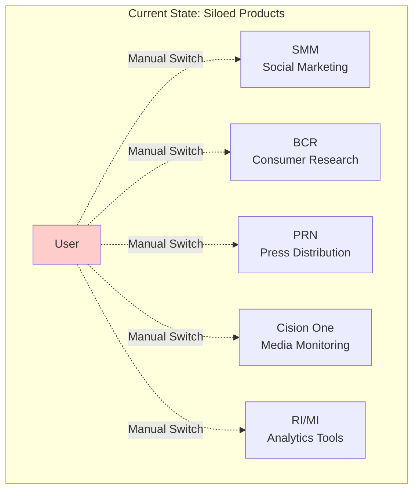
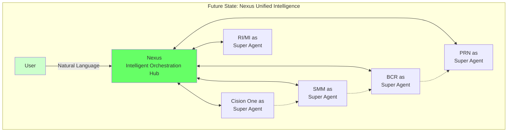

# The Nexus Vision and Current Challenges

## Current State: Product Silos Creating Customer Friction

Cision's portfolio includes five market-leading products, each serving critical functions in the PR and marketing ecosystem:

|Product|Core Capabilities|Data Sources|Key Challenge|
|---|---|---|---|
|**Social Media Marketing (SMM)**|Scheduling, monitoring, analytics|Social platforms via Brandwatch|Isolated from BCR insights|
|**Brandwatch Consumer Research (BCR)**|AI-powered consumer insights|100M+ online sources|Can't publish findings directly|
|**PR Newswire (PRN)**|Press release distribution|Media network, tiered reach|Disconnected from monitoring|
|**Cision One**|Unified media monitoring|Print, online, TV, radio, social, podcasts|Can't control other products|
|**RI & MI Tools**|Reporting & Intelligence|Analytics databases|Fragmented from real-time data|

This product richness creates a paradox: customers using one product increasingly need capabilities from another. BCR users want to create posts about their discoveries but must switch to SMM. Crisis detection in Cision One can't automatically prevent inappropriate scheduled posts in SMM. Each product maintains its own data silo, user interface, and workflow, forcing customers to become experts in multiple systems.

## The Nexus Vision: Intelligent Orchestration Across Products

Nexus reimagines how users interact with Cision's capabilities. Rather than choosing a product and working within its boundaries, users engage with a unified intelligence layer that understands their intent and orchestrates the appropriate capabilities across all products.

## Critical Success Factors

William and the team have clearly articulated the core challenges that must be addressed:

1. **User Intent Understanding** "Users aren't clear. They're awful at being descriptive. They don't know how our system thinks." Users express intent at different levels - sometimes they want a specific action ("block that post"), sometimes a complete workflow ("handle the crisis"), and sometimes just an outcome ("protect our brand"). The system must understand all levels.
   
2. **Overlapping Functionality Resolution** Multiple products offer similar capabilities - BCR, SMM, and Cision One all monitor social media; both BCR and Cision One track sentiment; PRN and SMM both distribute content. When a user asks to "monitor social conversations," which product should respond? The system must resolve these overlaps intelligently.
   
3. **Cross-Product Workflows** Users often want to achieve outcomes that require coordinated tasks across multiple products. For example, when a BCR crisis detection identifies a food contamination issue trending negatively on social media, the ideal workflow would be: 
	-  BCR automatically alerts the PR team, 
	- SMM immediately pauses all food-related promotional posts to prevent tone-deaf messaging, 
	- PRN adjusts any scheduled press releases to address the crisis, and 
	- Cision One escalates monitoring of traditional media coverage. 
	
	Currently, each of these actions requires manual coordination across different product interfaces - the Nexus system must orchestrate this entire cross-product workflow automatically.

4. **Intelligent Routing at Scale** "The larger and larger your agentic framework gets, the more difficult it is for the system to make the right call because it has so many options." With five products and hundreds of potential actions, the system needs a principled way to determine the optimal path.

5. **Agent Explainability** "If it does something crazy and we can't tell a person why, we've just lost that person." Every decision must be explainable, traceable, and auditable. Users need to understand not just what the system did, but why it chose that particular action.