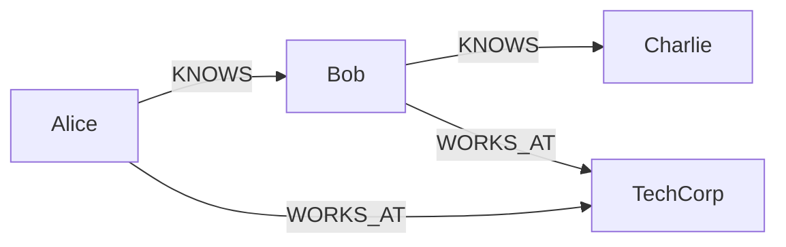

# In-Memory Graph POC Guide for React

## Option Comparison

| Feature | Cypher.js | MemGraph | Custom Implementation |
|---------|-----------|----------|----------------------|
| Cypher Support | ✅ Basic Cypher | ✅ Extended Cypher | ❌ Manual |
| Learning Curve | Low | Medium | High |
| Performance | Good | Better | Depends |
| Neo4j Compatibility | Good | Excellent | Manual |
| Bundle Size | ~100KB | ~200KB | Minimal |
| Active Development | Limited | Active | N/A |

## Recommended: MemGraph Implementation

MemGraph provides the most comprehensive Cypher support and closest Neo4j compatibility.

### Installation

```bash
npm install @memgraph/orb --save
# or for a lighter option
npm install cypher-query-builder --save
```

### Basic Implementation Structure

```typescript
// types/graph.ts
export interface NodeMetadata {
  [key: string]: any;
}

export interface EdgeMetadata {
  [key: string]: any;
}

export interface GraphNode {
  id: string;
  labels: string[];
  properties: NodeMetadata;
}

export interface GraphEdge {
  id: string;
  type: string;
  source: string;
  target: string;
  properties: EdgeMetadata;
}

export interface GraphData {
  nodes: GraphNode[];
  edges: GraphEdge[];
}
```

### Custom Lightweight Implementation

If you prefer a lightweight custom solution that's easy to port to Neo4j:

```typescript
// utils/InMemoryGraph.ts
export class InMemoryGraph {
  private nodes: Map<string, GraphNode>;
  private edges: Map<string, GraphEdge>;
  private nodeIndex: Map<string, Set<string>>; // label -> node ids
  private edgeIndex: Map<string, Set<string>>; // type -> edge ids

  constructor() {
    this.nodes = new Map();
    this.edges = new Map();
    this.nodeIndex = new Map();
    this.edgeIndex = new Map();
  }

  // Add node with labels and properties
  addNode(id: string, labels: string[], properties: NodeMetadata): void {
    const node: GraphNode = { id, labels, properties };
    this.nodes.set(id, node);
    
    // Update indices
    labels.forEach(label => {
      if (!this.nodeIndex.has(label)) {
        this.nodeIndex.set(label, new Set());
      }
      this.nodeIndex.get(label)!.add(id);
    });
  }

  // Add edge with type and properties
  addEdge(id: string, type: string, source: string, target: string, properties: EdgeMetadata): void {
    const edge: GraphEdge = { id, type, source, target, properties };
    this.edges.set(id, edge);
    
    // Update index
    if (!this.edgeIndex.has(type)) {
      this.edgeIndex.set(type, new Set());
    }
    this.edgeIndex.get(type)!.add(id);
  }

  // Basic Cypher-like operations
  matchNodes(label: string, whereClause?: (node: GraphNode) => boolean): GraphNode[] {
    const nodeIds = this.nodeIndex.get(label) || new Set();
    const nodes = Array.from(nodeIds)
      .map(id => this.nodes.get(id)!)
      .filter(node => !whereClause || whereClause(node));
    
    return nodes;
  }

  // Graph traversal
  traverse(startNodeId: string, edgeType: string, direction: 'out' | 'in' | 'both' = 'out'): GraphNode[] {
    const visited = new Set<string>();
    const result: GraphNode[] = [];
    
    const dfs = (nodeId: string) => {
      if (visited.has(nodeId)) return;
      visited.add(nodeId);
      
      const node = this.nodes.get(nodeId);
      if (node) result.push(node);
      
      // Find connected edges
      const edges = Array.from(this.edges.values()).filter(edge => {
        if (edge.type !== edgeType) return false;
        
        switch (direction) {
          case 'out': return edge.source === nodeId;
          case 'in': return edge.target === nodeId;
          case 'both': return edge.source === nodeId || edge.target === nodeId;
        }
      });
      
      // Continue traversal
      edges.forEach(edge => {
        const nextNodeId = edge.source === nodeId ? edge.target : edge.source;
        dfs(nextNodeId);
      });
    };
    
    dfs(startNodeId);
    return result;
  }

  // Find paths between nodes
  findPaths(startId: string, endId: string, maxDepth: number = 5): GraphNode[][] {
    const paths: GraphNode[][] = [];
    
    const dfs = (currentId: string, visited: Set<string>, path: GraphNode[], depth: number) => {
      if (depth > maxDepth) return;
      if (currentId === endId) {
        paths.push([...path]);
        return;
      }
      
      visited.add(currentId);
      
      // Get outgoing edges
      const edges = Array.from(this.edges.values()).filter(edge => edge.source === currentId);
      
      edges.forEach(edge => {
        if (!visited.has(edge.target)) {
          const targetNode = this.nodes.get(edge.target);
          if (targetNode) {
            path.push(targetNode);
            dfs(edge.target, new Set(visited), path, depth + 1);
            path.pop();
          }
        }
      });
    };
    
    const startNode = this.nodes.get(startId);
    if (startNode) {
      dfs(startId, new Set(), [startNode], 0);
    }
    
    return paths;
  }
}
```

### React Hook for Graph Operations

```typescript
// hooks/useInMemoryGraph.ts
import { useMemo } from 'react';
import { InMemoryGraph } from '../utils/InMemoryGraph';

export const useInMemoryGraph = (initialData?: GraphData) => {
  const graph = useMemo(() => {
    const g = new InMemoryGraph();
    
    if (initialData) {
      initialData.nodes.forEach(node => {
        g.addNode(node.id, node.labels, node.properties);
      });
      
      initialData.edges.forEach(edge => {
        g.addEdge(edge.id, edge.type, edge.source, edge.target, edge.properties);
      });
    }
    
    return g;
  }, [initialData]);
  
  return graph;
};
```

### Example Usage in React Component

```typescript
// components/GraphPOC.tsx
import React, { useEffect, useState } from 'react';
import { useInMemoryGraph } from '../hooks/useInMemoryGraph';
import { GraphNode } from '../types/graph';

const GraphPOC: React.FC = () => {
  const [results, setResults] = useState<GraphNode[]>([]);
  
  // Initialize graph with test data
  const graph = useInMemoryGraph({
    nodes: [
      { id: '1', labels: ['Person'], properties: { name: 'Alice', age: 30 } },
      { id: '2', labels: ['Person'], properties: { name: 'Bob', age: 25 } },
      { id: '3', labels: ['Person'], properties: { name: 'Charlie', age: 35 } },
      { id: '4', labels: ['Company'], properties: { name: 'TechCorp', industry: 'Software' } },
    ],
    edges: [
      { id: 'e1', type: 'KNOWS', source: '1', target: '2', properties: { since: 2020 } },
      { id: 'e2', type: 'KNOWS', source: '2', target: '3', properties: { since: 2019 } },
      { id: 'e3', type: 'WORKS_AT', source: '1', target: '4', properties: { role: 'Engineer' } },
      { id: 'e4', type: 'WORKS_AT', source: '2', target: '4', properties: { role: 'Manager' } },
    ]
  });
  
  // Example queries
  const runQueries = () => {
    // 1. Find all people over 25
    const people = graph.matchNodes('Person', node => node.properties.age > 25);
    console.log('People over 25:', people);
    
    // 2. Traverse from Alice through KNOWS relationships
    const aliceNetwork = graph.traverse('1', 'KNOWS', 'out');
    console.log('Alice\'s network:', aliceNetwork);
    
    // 3. Find paths between Alice and Charlie
    const paths = graph.findPaths('1', '3', 3);
    console.log('Paths from Alice to Charlie:', paths);
    
    setResults(people);
  };
  
  useEffect(() => {
    runQueries();
  }, []);
  
  return (
    <div>
      <h2>Graph POC Results</h2>
      <ul>
        {results.map(node => (
          <li key={node.id}>
            {node.labels.join(', ')}: {JSON.stringify(node.properties)}
          </li>
        ))}
      </ul>
    </div>
  );
};

export default GraphPOC;
```

## Porting to Neo4j

When you're ready to move to Neo4j, your queries will translate easily:

### In-Memory Query
```typescript
const people = graph.matchNodes('Person', node => node.properties.age > 25);
```

### Neo4j Cypher
```cypher
MATCH (n:Person)
WHERE n.age > 25
RETURN n
```

### Graph Traversal Comparison



## Next Steps

1. **For Simple POC**: Use the custom implementation above
2. **For Complex Queries**: Consider integrating `@memgraph/orb` or `cypher-query-builder`
3. **For Production**: Plan migration strategy to Neo4j

## Testing Algorithms

Create test scenarios like:
- Social network analysis (friend-of-friend recommendations)
- Organizational hierarchy traversal
- Shortest path algorithms
- Pattern matching for fraud detection
- Recommendation engines

Each algorithm you develop with the in-memory graph will port directly to Neo4j with minimal changes to the query logic.